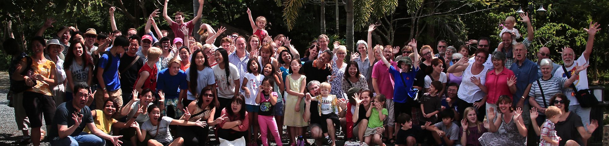

## I'm New Here

Welcome! We hope you will consider making ICF your home church during your time in Cambodia. 
We desire to connect with our newcomers and visitors and foster a sense of belonging to those 
who may be far from home. If you would like to know more about our church vision and ministries 
please email [phnompenhicf@gmail.com](phnompenhicf@gmail.com)

We have 2 services that meet in different parts of Phnom Penh.
**ICF North meet Sunday, 9.30am at HOPE International School,**
#532 St Try Heng 3, Sen Sok. This is a family-friendly service.
[Google map](https://goo.gl/maps/fJuXRrKpmG96mqyA7).

**ICF South meet Sunday, 10.30am at Red Ginseng Cafe,** 
#31 St 430 corner St 500, Phsar Deum Thkov near the Mermaid Roundabout. 
Google map: ឃេ-ប្រេន កាហ្វេ [https://goo.gl/maps/evkC79ueYvYbxCsV9](https://goo.gl/maps/evkC79ueYvYbxCsV9)
On Grab pin "Red Ginseng Cafe"

Please follow us on Facebook for more information: 
[www.facebook.com/icfpp/](www.facebook.com/icfpp/)

## Introduce yourself!
We would love to get to know you. We have a special time during our Sunday services for visitors to introduce themselves and tell us why they're in Cambodia. 

## Have questions about the Christian faith?
If you have recently decided to follow Jesus or if you want to know more about God, the Bible or Christianity, we would be very happy to talk with you. 

## Home Groups
Home Group is a great way to get to know other believers on a more personal level. Here is where you can gather with people in a similar life stage as you, study the Bible together, seek prayer and gain support. Fun and food is also often involved! 

<h3>
We look forward to meeting and getting to know you!
</h3>

